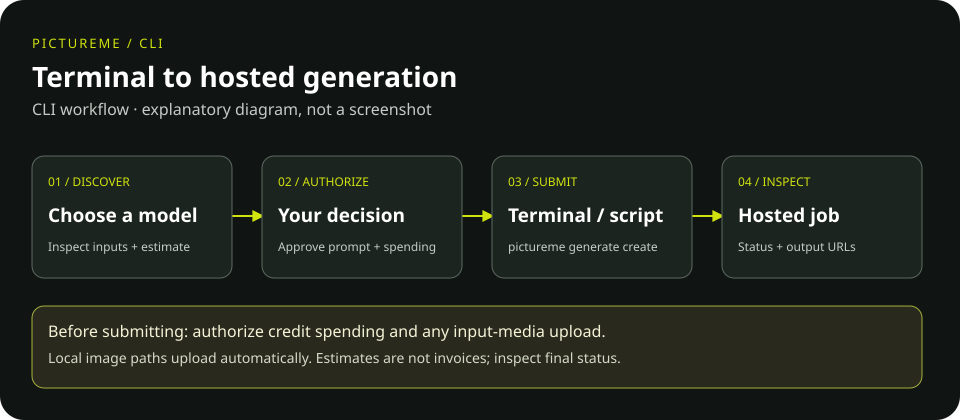

<picture>
  <source media="(prefers-color-scheme: dark)" srcset="docs/assets/pictureme-lockup-dark.svg">
  <source media="(prefers-color-scheme: light)" srcset="docs/assets/pictureme-lockup-light.svg">
  
</picture>

# PictureME CLI

Use PictureME from your terminal: find image and video models, upload reference
media, submit generation jobs, and check their status and your credit balance.
This Python client talks to the hosted PictureME API; it does not run models
locally or include the commercial backend.

## Who is it for?

Creators who prefer a terminal, developers writing scripts, and operators who
already have the required service permissions. `pictureme` and `picme` are
interchangeable command names.

**CLI or MCP?** Use this CLI when you type commands or call them from a script.
Use [PictureME MCP](https://github.com/Pachecodes/pictureme-mcp-public) when a
compatible AI assistant should call PictureME tools for you.

## How it works



*Explanatory diagram, not a screenshot. Approval is your responsibility, not an
automatic client safeguard.*

## Install

Requires **Python 3.10+**. In a reviewed standalone checkout:

```bash
python -m venv .venv
source .venv/bin/activate
python -m pip install .
pictureme --help
```

No monorepo is needed. Use a reviewed checkout or digest-verified wheel;
package-index publication is not asserted. See [installation](docs/installation.md)
for approved-artifact and immutable-commit options.

## Try a read first

```bash
pictureme model list --image
pictureme --json model list
```

The live catalog tells you which model IDs and inputs are available. These reads
do not submit a generation; public catalog access may work without login.

## Example: make an image

Log in with `pictureme auth login` and approve the device in your browser.
Choose a real image model from the catalog and inspect it before spending:

```bash
pictureme model get MODEL_ID
pictureme generate cost MODEL_ID
# Only after you approve the cost and prompt:
pictureme generate create MODEL_ID --prompt "A landscape at sunrise" --wait
```

Replace `MODEL_ID` with a supported live ID. This is a paid example, **not a smoke
test**. Waiting polls the job; inspect its final status and any output URLs.
See [usage](docs/usage.md) for reference images and job reads.

## Account, credits and privacy

Authenticated operations need a PictureME account, service access and suitable
permissions. Generations spend credits; estimates are not guaranteed invoices.
Uploads share your input media with the service. Cancellation guarantees neither
a provider stop nor a refund. Installing MIT code grants no account or credits.

Keep keys out of logs and source control. Saved POSIX credentials are private
plaintext files, not encrypted. See [credential safety](docs/credentials.md).
Operator commands need separate authorization; `workflow run` is unimplemented
and some booth commands are placeholders. See [limitations](docs/permissions.md).

## Documentation

- [Manual and reading guide](docs/README.md)
- [Installation](docs/installation.md) and [usage examples](docs/usage.md)
- [Credentials](docs/credentials.md) and [permissions](docs/permissions.md)
- [Development and offline tests](docs/development.md)
- [Brand assets and rights](docs/brand-assets.md)

## Project and license

Maintained by **Jesus Pacheco / Akitá Labs**.
[Contributing](CONTRIBUTING.md) · [Security policy](SECURITY.md) ·
[Provenance](PROVENANCE.md) · [MIT code license](LICENSE).
Logo/trademark rights and hosted-service terms are separate from the code license.
